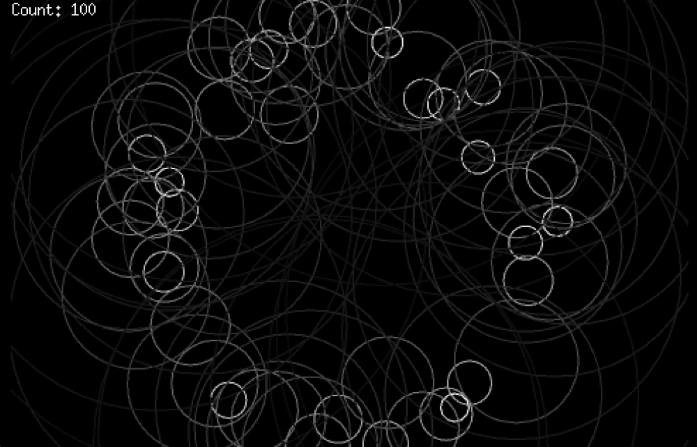

# ゲームエンジンEbitengineを使ってアートを描いてみよう

[English version](INSTRUCTION_en.md)

## 完成図



## 完成図の解説

円の内側に円形に広がる無数の波紋を描きます。

描画のルール

- 外円の内側に波紋を表現した小さな円をランダムな位置に配置
  - 外円 (screenWidth または screenHeight の半分を半径とする円) を想定します
  - 小さな円の中心からの距離は log10(1-1000の乱数)/3 * 外円の半径で求める
  - 小さな円の角度は 0 - 2π の乱数で決定する
- 毎描画毎に波紋を拡大しつつ、色を薄くしていきます
- 最大の波紋数を超えたら古いものから削除していきます
- 毎描画毎に新しい波紋を新規に配置します

## サンプル解答

[answers](./answers/) に各stepのサンプル解答を用意してるので、詰まってしまったら参考にしてください。

## Ebitengine インストール

公式サイトのインストール手順に沿ってインストールします。
https://ebitengine.org/ja/documents/install.html?os=linux

`Hello, World!` が表示されるところまで進めましょう。

## step.1 円を一つ描いてみよう

基本的なベクタグラフィクスは vector packageで提供されているので、まずは円を一つ描いてみよう。
https://pkg.go.dev/github.com/hajimehoshi/ebiten/v2/vector

```sh
go get github.com/hajimehoshi/ebiten/v2/vector
```

<details>
  <summary>ヒント</summary>

`Draw`関数 で `vector.StrokeCircle` を使うと円を描くことができる。
</details>

## step.2 円を変化させてみよう

円の大きさ(半径r)と、色を変化させてみましょう。
変化を管理するために、半径rと色cをフィールドに持つ`Bubble struct`を定義しましょう。

<details>
  <summary>ヒント</summary>

```go
var (
	Magnification    float32 = 1.03 // 拡大率
	ColorAttenuation float32 = 0.98 // 色の減衰率
)

type Bubble struct {
	R float32
	C uint8 // Gray scale color
}
```

変化させるためには、Update関数で値を変更します。

また、変化スピードはebitengineのTPS(tick per second)に依存してしまうので、必要に応じて ebiten.SetTPS(n) で調整しましょう。 

</details>

## step.3 円の位置をランダムに変えてみよう

円の位置(x, y)もパラメータにしてBubble structで管理するようにしましょう。
`math/rand/v2`パッケージを使うと手軽に乱数を生成できます。

## step.4 円を多数配置してみよう

一つの円を配置、変化させることができたので、これを多数配置できるようにしましょう。
ひとまず円の数は100にしてみましょう。

円の数を正確に管理できているかは、 `ebitenutil.DebugPrint()`を使って数を表示することで確認してみましょう。

円は追加・削除を繰り返しますが、Go のsliceは継続的に追加・削除を行うことに向いていないので、container/list を使うと良いでしょう。
https://pkg.go.dev/container/list

queueのように使いたい場合は、以下のように使えます。

- list.PushFront() で追加(enqueue操作)
- list.Remove(list.Back()) 取得しつつ削除(dequeue操作)

要素を全て捜査する場合は、ドキュメントの通りにします。

```go
for e := l.Front(); e != nil; e = e.Next() {
	// do something with e.Value
}
```

## step.5 円を外円に沿って配置するようにしてみよう

ここまででもいい感じですが、円の発生に法則性を持たせてみましょう。
大きな外円に沿うように小さな円を多数発生するようにしてみましょう。
外円に沿うようにランダムに配置するためには、三角関数を使うと良いでしょう。
また、外円の中心からの距離もランダムにしてみましょう。

<details>
  <summary>ヒント</summary>

半径Rの外円の中心からの距離dを乱数で決定するには。

```go
d := rand.Float32() * R
```

三角関数を使って円に沿って配置する場合は、角度theta(0-2π)を乱数で決めると良いので、

```go
theta := rand.Float32() * math.Pi * 2
```

イメージとしては、(0, d)に点を配置して、角度thetaだけ回転移動させるイメージです。
回転操作は原点を(0,0)とした場合に以下の計算で行えます。

```
x2 = x * cos(θ) - y * sin(θ)
y2 = x * sin(θ) + y * cos(θ)
```

</details>

## (Next step) 色々といじってみよう

- パラメータを変えてみる
- 色を変えてみる
- 円ではないもので描画してみる
- ユーザー入力を受け付けて変化を起こす
- etc...
